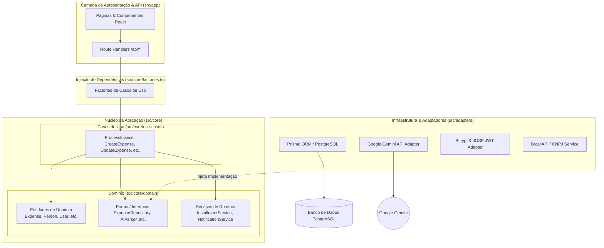
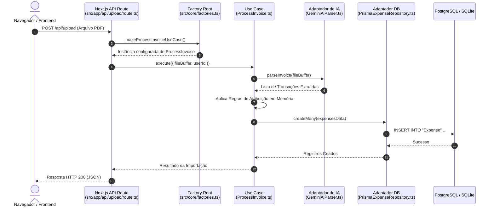

# Arquitetura do Sistema (Software Design Document — SDD)

Este documento descreve a arquitetura técnica, os padrões de projeto e a organização em camadas do **Financial Manager Lite**.

> ⬅️ [Voltar para a documentação principal](../README.md#-%EF%B8%8F-documenta%C3%A7%C3%A7%C3%A3o)

---

## 1. Visão Geral da Arquitetura

O sistema adota os princípios da **Clean Architecture** (Arquitetura Limpa), promovendo o desacoplamento entre regras de negócio, infraestrutura de dados e a camada de apresentação Web.



---

## 2. Camadas do Sistema

### 2.1 Camada de Domínio (`src/core/domain/`)

É a camada mais interna e independente da aplicação. Não possui nenhuma dependência de frameworks externos ou banco de dados.

- **Entidades (`src/core/domain/entities/`)**: Classes e interfaces puras TypeScript que definem os modelos do negócio.
  - `Expense.ts`, `Person.ts`, `User.ts`, `AssignmentRule.ts`, `CategoryRule.ts`, `PaymentStatus.ts`, `Notification.ts`, `AuditLog.ts`, `IntegrationLog.ts`, `SystemBank.ts`, `SystemCategory.ts`.
- **Portas (`src/core/domain/ports/`)**: Contratos de interface que definem a comunicação com o mundo externo (Inversão de Dependência).
  - `ExpenseRepository.ts`: Métodos de persistência de despesas.
  - `AiParser.ts`: Contrato para parsing de arquivos PDF de faturas.
  - `PasswordHasher.ts` / `TokenService.ts`: Contratos de segurança e autenticação.
- **Serviços de Domínio (`src/core/domain/services/`)**: Regras de negócio complexas que envolvem múltiplas entidades.
  - `InstallmentService.ts`: Lógica de cálculo, detecção e propagação de compras parceladas.
  - `NotificationService.ts`: Geração de notificações de pagamentos para devedores.
  - `IntegrationLogger.ts`: Auditoria de chamadas externas de integração.

### 2.2 Camada de Casos de Uso (`src/core/use-cases/`)

Contém as regras de aplicação. Cada caso de uso é representado por uma classe com método único `execute()`.

- **Exemplos de Use Cases (52 no total)**:
  - `ProcessInvoice.ts`: Orquestra leitura via IA, aplicação de regras de palavra-chave e inserção em lote.
  - `CreateExpense.ts`: Valida e registra novos lançamentos manuais ou importados.
  - `UpdateExpense.ts`: Atualiza dados de uma despesa e dispara propagação de parcelas se aplicável.
  - `SyncCategoryRules.ts`: Aplica regras de categorização automática sobre transações existentes.

### 2.3 Camada de Adaptadores (`src/adapters/`)

Implementa as portas definidas no domínio utilizando tecnologias e bibliotecas concretas.

- **`src/adapters/db/`**: Implementação das portas de repositório utilizando Prisma ORM.
- **`src/adapters/ai/`**: Implementador `GeminiAiParser` que consome a API do Google Gemini com fallback automático de modelos (`gemini-2.5-flash` → `gemini-1.5-flash`).
- **`src/adapters/auth/`**: Adaptadores concretos para hash de senhas (`BcryptHasher`) e tokens JWT (`JoseTokenService`).

### 2.4 Camada de Apresentação (`src/app/`)

Construída sobre o **Next.js 16 (App Router)** com componentes React 19.

- **Rotas de Interface (`src/app/`)**:
  - `/dashboard`: Painel geral com indicadores e gráficos de divisão de contas.
  - `/import`: Interface de upload e staging de faturas PDF.
  - `/people`: Gerenciamento unificado de integrantes e convites.
  - `/expenses`: Tabela completa de histórico de transações.
  - `/rules`: Gerenciamento de regras de atribuição e categorização.
- **Componentes Compartilhados (`src/components/`)**:
  - `DataTable.tsx`, `MonthSelector.tsx`, `EditExpenseModal.tsx`, `BulkActionsBar.tsx`, `NotificationsModal.tsx`.

---

## 3. Padrão Factory e Injeção de Dependências

Para manter o desacoplamento, os Casos de Uso não instanciam adaptadores diretamente. O arquivo `src/core/factories.ts` atua como o **Composition Root** da aplicação.

```typescript
// Exemplo conceitual da estrutura da Factory (src/core/factories.ts)
export function makeProcessInvoiceUseCase() {
  const expenseRepository = new PrismaExpenseRepository();
  const personRepository = new PrismaPersonRepository();
  const ruleRepository = new PrismaAssignmentRuleRepository();
  const aiParser = new GeminiAiParser();

  return new ProcessInvoiceUseCase(
    expenseRepository,
    personRepository,
    ruleRepository,
    aiParser
  );
}
```

---

## 4. Fluxo de Execução de uma Requisição HTTP

O diagrama a seguir ilustra o ciclo de vida completo de uma chamada de API no sistema:


