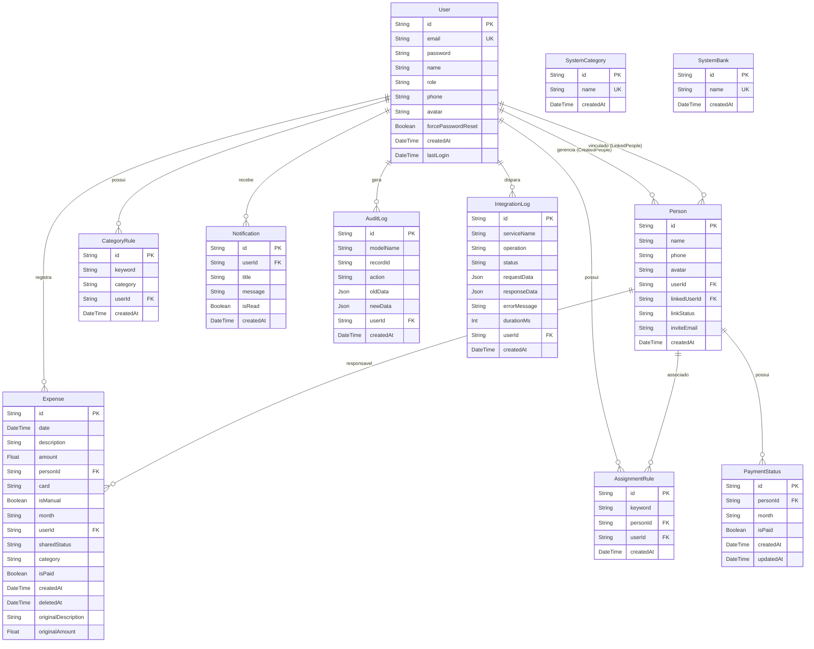

# Esquema do Banco de Dados (Database Specification)

Este documento descreve a estrutura de persistência relacional do **Financial Manager Lite**, incluindo os 11 modelos mapeados via **Prisma ORM**, tipos de dados, relacionamentos, chaves e índices.

> ⬅️ [Voltar para a documentação principal](../README.md#-%EF%B8%8F-documenta%C3%A7%C3%A7%C3%A3o)

---

## 1. Visão Geral do Banco

- **SGBD**: PostgreSQL (compatível com SQLite para desenvolvimento local)
- **ORM**: Prisma Client v6.2.1
- **Estratégia de ID**: CUID (Collision-Resistant Unique Identifiers)
- **Arquivo de Schema**: `prisma/schema.prisma`

---

## 2. Diagrama Entidade-Relacionamento (ER Diagram)

---

## 3. Especificação dos Modelos

### 3.1 Model `User`
Armazena a conta de acesso dos usuários do sistema.

| Campo | Tipo | Nulo | Descrição |
| :--- | :--- | :--- | :--- |
| `id` | `String` | Não | Chave primária (`cuid()`) |
| `email` | `String` | Não | E-mail de login (Único) |
| `password` | `String` | Não | Hash Bcrypt da senha |
| `name` | `String` | Não | Nome completo |
| `role` | `String` | Não | Papel (`"USER"` ou `"ADMIN"`, default `"USER"`) |
| `phone` | `String` | Sim | Telefone/WhatsApp do usuário |
| `avatar` | `String` | Sim | Foto de perfil (Base64 ou URL) |
| `forcePasswordReset` | `Boolean` | Não | Exige troca de senha no próximo login (default `false`) |
| `createdAt` | `DateTime` | Não | Data de cadastro |
| `lastLogin` | `DateTime` | Sim | Data do último acesso |

---

### 3.2 Model `Person`
Representa os integrantes do grupo cadastrados pelo usuário para divisão de contas.

| Campo | Tipo | Nulo | Descrição |
| :--- | :--- | :--- | :--- |
| `id` | `String` | Não | Chave primária (`cuid()`) |
| `name` | `String` | Não | Nome do integrante |
| `phone` | `String` | Sim | WhatsApp de contato |
| `avatar` | `String` | Sim | Imagem de avatar |
| `userId` | `String` | Não | FK do usuário criador (`User`) |
| `linkedUserId` | `String` | Sim | FK do usuário caso a pessoa tenha conta no app (`User`) |
| `linkStatus` | `String` | Não | Status da vinculação (`"NONE"`, `"PENDING"`, `"ACCEPTED"`, `"REJECTED"`) |
| `inviteEmail` | `String` | Sim | E-mail informado no convite |

- **Índices**: `@@index([userId])`

---

### 3.3 Model `Expense`
Registra cada lançamento financeiro (manual ou importado de fatura PDF).

| Campo | Tipo | Nulo | Descrição |
| :--- | :--- | :--- | :--- |
| `id` | `String` | Não | Chave primária (`cuid()`) |
| `date` | `DateTime` | Não | Data do gasto |
| `description` | `String` | Não | Descrição/Nome da transação |
| `amount` | `Float` | Não | Valor em Reais (`R$`) |
| `personId` | `String` | Sim | FK do integrante atribuído (`Person`) |
| `card` | `String` | Sim | Nome do cartão de crédito (ex: `"Nubank"`) |
| `isManual` | `Boolean` | Não | Indica se foi lançamento manual ou via PDF |
| `month` | `String` | Não | Mês da fatura formato `YYYY-MM` |
| `userId` | `String` | Não | FK do usuário dono da despesa (`User`) |
| `sharedStatus` | `String` | Não | Status do aceite (`"PENDING"`, `"ACCEPTED"`, `"REJECTED"`) |
| `category` | `String` | Sim | Categoria inteligente da despesa |
| `isPaid` | `Boolean` | Não | Status de baixa/quitação do gasto |
| `originalDescription` | `String` | Sim | Nome original na fatura antes de edição |
| `originalAmount` | `Float` | Sim | Valor original antes de edição |

- **Índices Compostos**:
  - `@@index([userId, month])`
  - `@@index([userId, personId])`

---

### 3.4 Model `AssignmentRule`
Regra para atribuição automática de integrante por palavra-chave na importação de fatura.

| Campo | Tipo | Nulo | Descrição |
| :--- | :--- | :--- | :--- |
| `id` | `String` | Não | Chave primária (`cuid()`) |
| `keyword` | `String` | Não | Termo de busca (ex: `"uber"`) |
| `personId` | `String` | Não | FK do integrante associado |
| `userId` | `String` | Não | FK do usuário dono da regra |

- **Constraint Única**: `@@unique([userId, keyword])`

---

### 3.5 Model `CategoryRule`
Regra para categorização automática por palavra-chave.

| Campo | Tipo | Nulo | Descrição |
| :--- | :--- | :--- | :--- |
| `id` | `String` | Não | Chave primária (`cuid()`) |
| `keyword` | `String` | Não | Termo de busca (ex: `"ifood"`) |
| `category` | `String` | Não | Categoria atribuída (ex: `"Alimentação"`) |
| `userId` | `String` | Não | FK do usuário dono da regra |

- **Constraint Única**: `@@unique([userId, keyword])`

---

### 3.6 Model `PaymentStatus`
Controle do status de quitação mensal consolidada das contas de um integrante.

- **Constraint Única**: `@@unique([personId, month])`

---

### 3.7 Model `Notification`
Central de notificações enviadas aos usuários.

- **Índice**: `@@index([userId, isRead])`

---

### 3.8 Models `AuditLog` e `IntegrationLog`
Tabelas de segurança, compliance e monitoramento técnico.

- **Índices de Performance**: `@@index([userId, createdAt])` em ambos os modelos.
